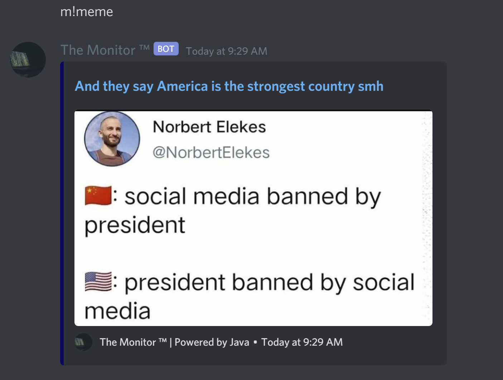
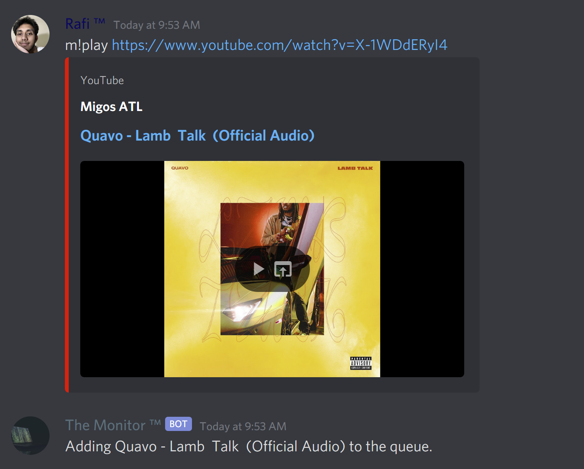
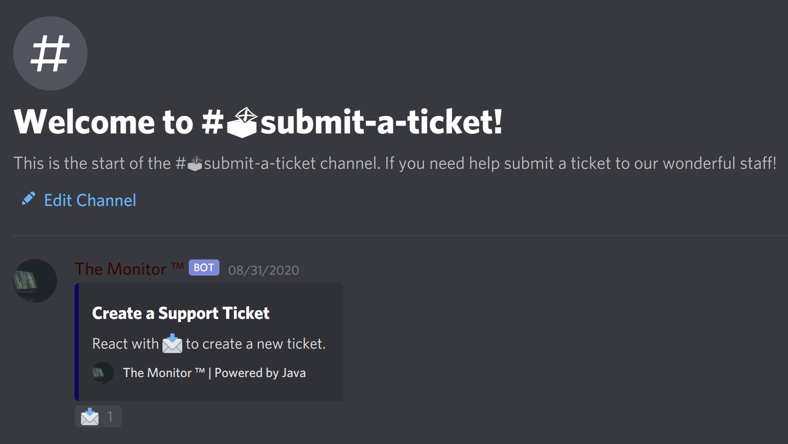
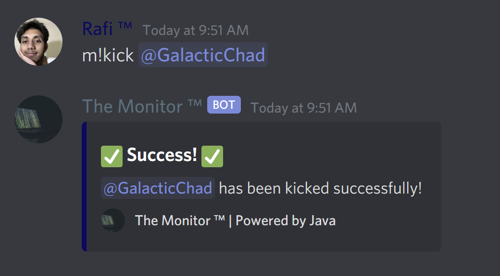

# Bot Commands

## About
Here you will find some of the many commands my bot can execute. Click on the links in the table below to read about the commands in further detail!

<table>
    <tbody>
        <tr>
            <td><a href="https://rafi-99.github.io/The-Monitor/botinfo">Bot Info</a></td>
            <td></td>
        </tr>
        <tr>
            <td><a href="https://rafi-99.github.io/The-Monitor/serverinfo">Server Info</a></td>
            <td></td>
        </tr> 
        <tr>
            <td><a href="https://rafi-99.github.io/The-Monitor/ping">Ping</a></td>
            <td></td>
        </tr>
        <tr>
            <td><a href="https://rafi-99.github.io/The-Monitor/meme">Memes</a></td>
            <td></td>
        </tr> 
        <tr>
            <td><a href="https://rafi-99.github.io/The-Monitor/rps">Rock Paper Scissors</a></td>
            <td></td>
        </tr>
        <tr>
            <td><a href="https://rafi-99.github.io/The-Monitor/music">Music</a></td>
            <td></td>
        </tr>
        <tr>
            <td><a href="https://rafi-99.github.io/The-Monitor/ticketsetup">Ticket System</a></td>
            <td></td>
        </tr>
        <tr>
            <td><a href="https://rafi-99.github.io/The-Monitor/moderation">Moderation</a></td>
            <td></td>
        </tr>
        <tr>
            <td><a href="https://rafi-99.github.io/The-Monitor/purge">Message Deletion</a></td>
            <td></td>
        </tr>
    </tbody>
</table>

## More From This Site
* [Home](https://rafi-99.github.io/The-Monitor/)
* [Bot Commands](https://rafi-99.github.io/The-Monitor/commands)