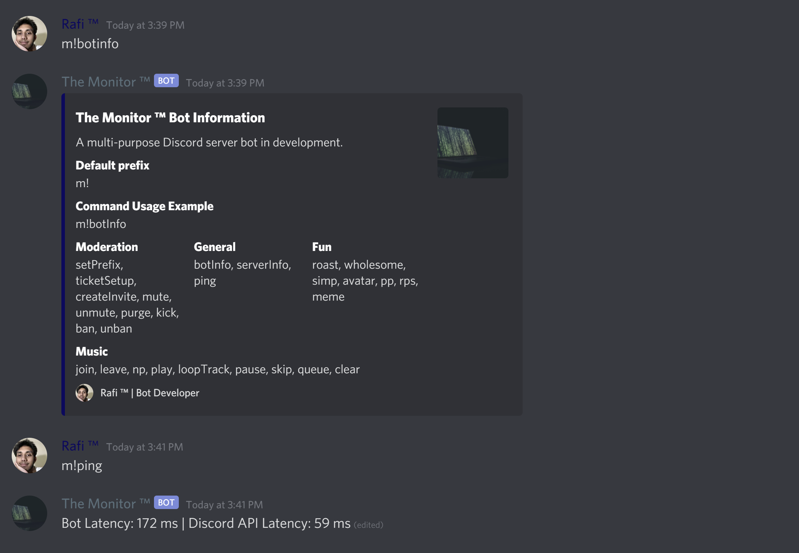
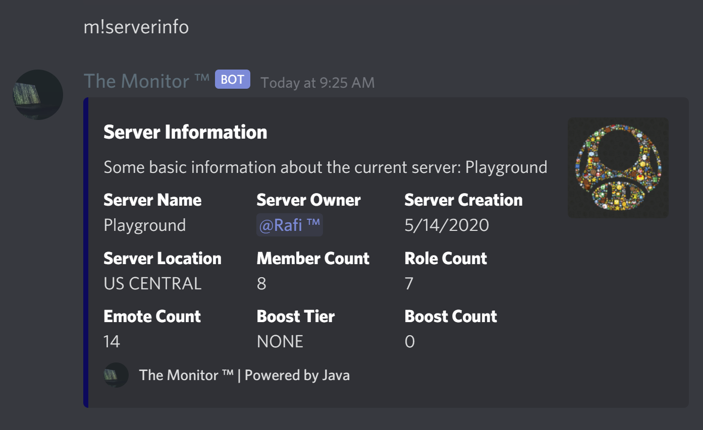
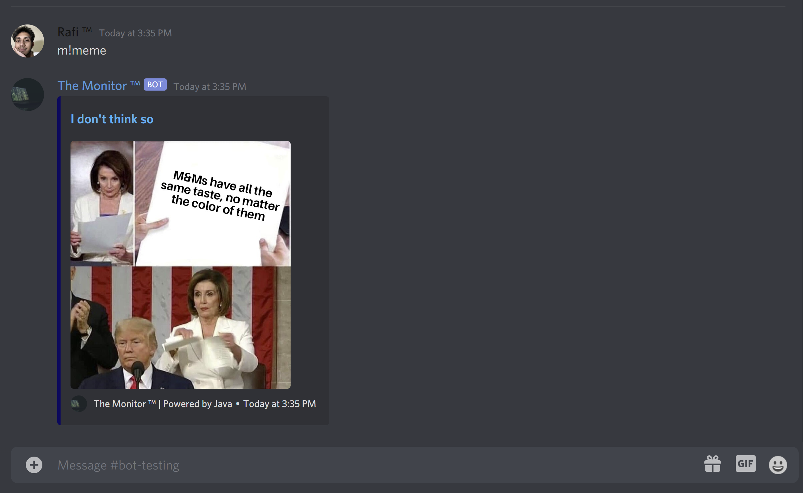
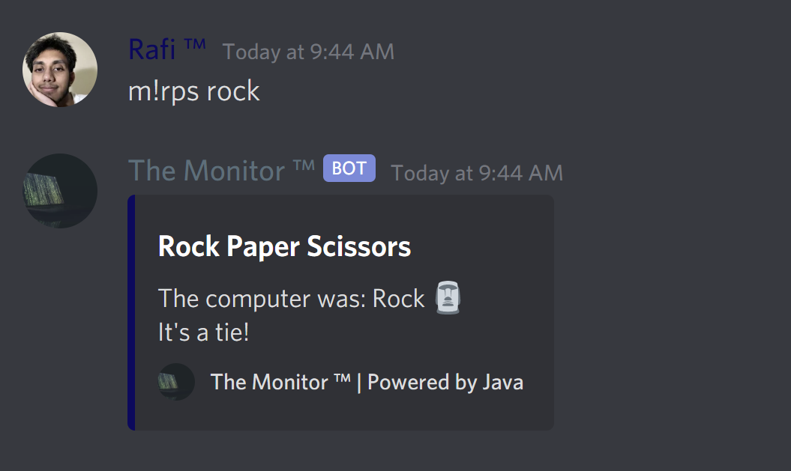
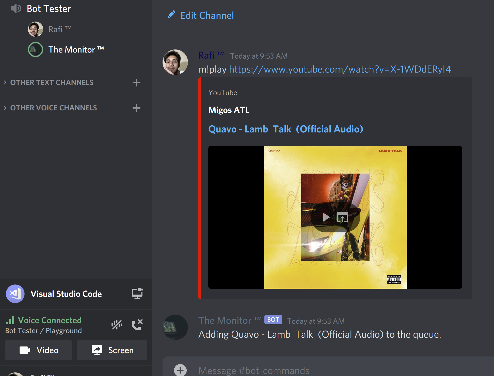
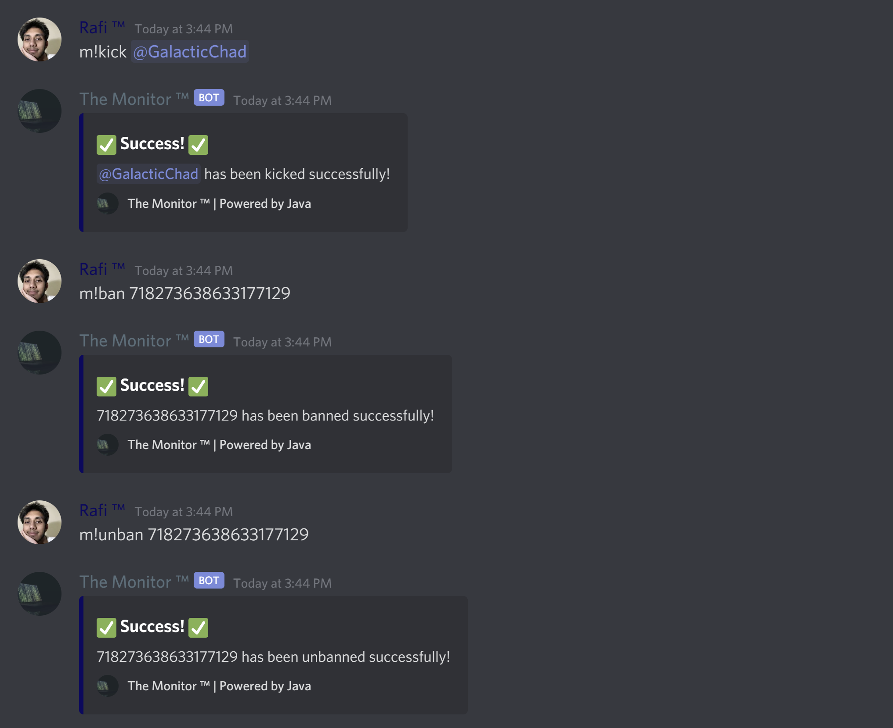
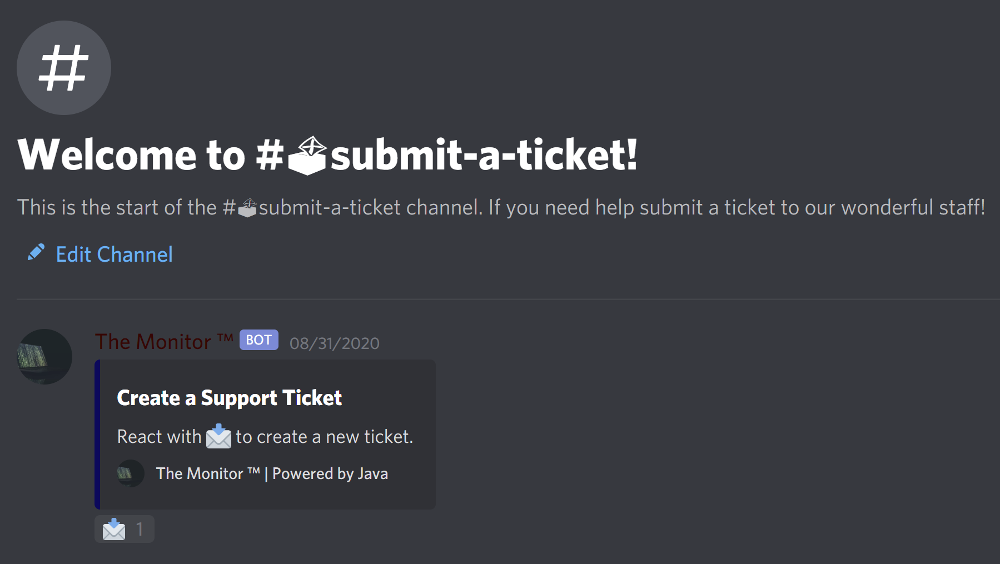
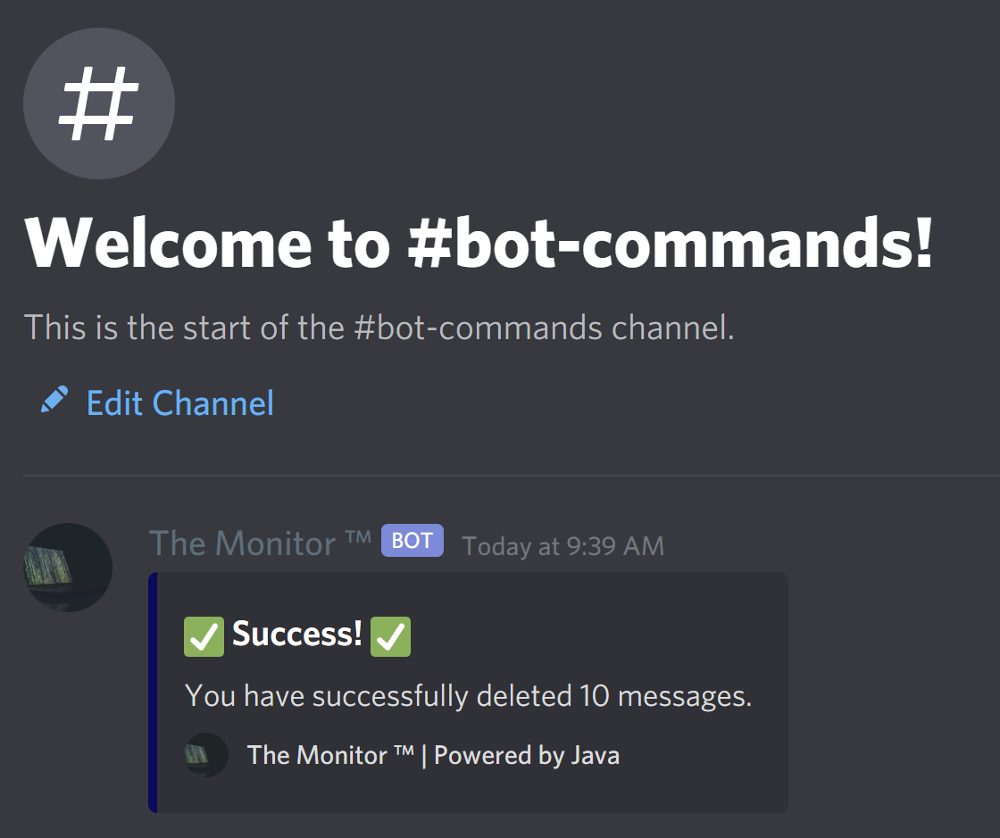

# The Monitor ™ Demo

## About
Scroll down to see some examples of The Monitor ™ in action!

<table>
    <tbody>
        <tr>
            <td>Bot Info</td>
            <td></td>
            <td>Server Info</td>
            <td></td>
        </tr>
        <tr>
            <td>Meme Command</td>
            <td></td>
            <td>Rock Paper Scissors</td>
            <td></td>
        </tr>
        <tr>
            <td>Music</td>
            <td></td>
            <td>Moderation</td>
            <td></td>
        </tr>
        <tr>
            <td>Ticket System</td>
            <td></td>
            <td>Message Purge</td>
            <td></td>
        </tr>
    </tbody>
</table>

## More From This Site
* [Home](https://rafi-99.github.io/The-Monitor/)
* [Demo](https://rafi-99.github.io/The-Monitor/demo)